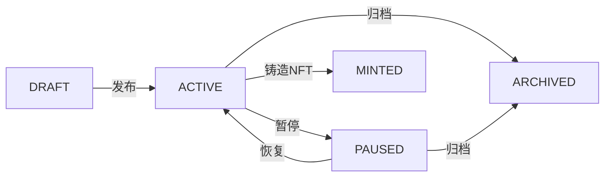

# Agent 管理模块 - 后端 API 文档

## 📌 概述

Agent 管理模块提供了完整的 CRUD API，用于管理 AI Agent 的注册、查询、更新和删除。所有 Agent 都存储在 PostgreSQL 数据库中，支持分类、标签、筛选和排序功能。

**版本**: v2.0  
**基础 URL**: `http://localhost:3000`  
**认证方式**: JWT Bearer Token（部分接口需要）

---

## 🔐 认证说明

### 获取 Token

```bash
# 1. 获取 nonce
curl -X POST http://localhost:3000/auth/nonce \
  -H "Content-Type: application/json" \
  -d '{"walletAddress": "0xYourAddress"}'

# 2. 使用钱包签名 message

# 3. 登录获取 token
curl -X POST http://localhost:3000/auth/login \
  -H "Content-Type: application/json" \
  -d '{
    "walletAddress": "0xYourAddress",
    "signature": "0xYourSignature"
  }'
```

**响应示例**:

```json
{
  "success": true,
  "data": {
    "access_token": "eyJhbGciOiJIUzI1NiIsInR5cCI6IkpXVCJ9...",
    "user": {
      "id": 1,
      "walletAddress": "0xf39fd6e51aad88f6f4ce6ab8827279cfffb92266"
    }
  }
}
```

---

## 📋 API 端点列表

| Method | Endpoint                   | 功能                         | 认证          |
| ------ | -------------------------- | ---------------------------- | ------------- |
| POST   | `/agents`                  | 创建 Agent                   | ✅ 必须       |
| GET    | `/agents`                  | 列表查询（分页、筛选、排序） | ❌ 公开       |
| GET    | `/agents/featured`         | 获取精选 Agents（按分类）    | ❌ 公开       |
| GET    | `/agents/popular`          | 获取热门 Agents              | ❌ 公开       |
| GET    | `/agents/categories/stats` | 分类统计                     | ❌ 公开       |
| GET    | `/agents/tags`             | 获取所有标签                 | ❌ 公开       |
| GET    | `/agents/:id`              | 获取 Agent 详情              | ❌ 公开       |
| PUT    | `/agents/:id`              | 更新 Agent                   | ✅ owner only |
| DELETE | `/agents/:id`              | 删除 Agent                   | ✅ owner only |

---

## 🔹 1. 创建 Agent

创建一个新的 Agent（需认证）。

**请求**:

```http
POST /agents
Authorization: Bearer YOUR_JWT_TOKEN
Content-Type: application/json
```

**请求体**:

```json
{
  "name": "Code Review Agent",
  "description": "AI-powered code review assistant for JavaScript/TypeScript projects",
  "shortDesc": "Automated code review",
  "category": "DEVELOPER_TOOLS",
  "tags": ["code-review", "javascript", "typescript"],
  "capabilities": ["code-review", "bug-detection", "security-scan"],
  "endpointUrl": "https://your-agent.vercel.app/api/v1/execute",
  "endpointAuthType": "public",
  "healthCheckUrl": "https://your-agent.vercel.app/api/health",
  "timeoutMs": 60000
}
```

**字段说明**:

| 字段               | 类型     | 必填 | 说明                                                                           |
| ------------------ | -------- | ---- | ------------------------------------------------------------------------------ |
| `name`             | string   | ✅   | Agent 名称（1-100 字符）                                                       |
| `description`      | string   | ✅   | 详细描述（10-2000 字符）                                                       |
| `shortDesc`        | string   | ❌   | 简短描述（最多 150 字符）                                                      |
| `avatar`           | string   | ❌   | 头像 URL                                                                       |
| `category`         | enum     | ✅   | 分类：`PRODUCTIVITY_TOOLS`, `CREATIVE_ASSISTANTS`, `DEVELOPER_TOOLS`, `OTHERS` |
| `tags`             | string[] | ✅   | 标签列表（1-10 个，每个最多 20 字符）                                          |
| `capabilities`     | string[] | ❌   | 能力列表                                                                       |
| `endpointUrl`      | string   | ✅   | Agent API 端点 URL                                                             |
| `endpointAuthType` | enum     | ❌   | 认证类型：`public`（默认）, `bearer`, `api-key`                                |
| `healthCheckUrl`   | string   | ❌   | 健康检查端点                                                                   |
| `timeoutMs`        | number   | ❌   | 超时时间（默认 30000ms）                                                       |
| `configuration`    | object   | ❌   | 配置 JSON                                                                      |
| `inputSchema`      | object   | ❌   | 输入规范（JSON Schema）                                                        |
| `outputSchema`     | object   | ❌   | 输出规范（JSON Schema）                                                        |

**响应** (201 Created):

```json
{
  "success": true,
  "data": {
    "id": 1,
    "name": "Code Review Agent",
    "description": "AI-powered code review assistant...",
    "category": "DEVELOPER_TOOLS",
    "tags": ["code-review", "javascript", "typescript"],
    "status": "DRAFT",
    "endpointUrl": "https://your-agent.vercel.app/api/v1/execute",
    "endpointAuthType": "public",
    "isVerified": false,
    "healthStatus": "UNKNOWN",
    "viewCount": 0,
    "ownerId": 1,
    "createdAt": "2026-01-06T14:30:00.000Z",
    "owner": {
      "id": 1,
      "walletAddress": "0xf39fd6e51aad88f6f4ce6ab8827279cfffb92266"
    }
  }
}
```

> **注意**: 如果 `endpointAuthType` 是 `bearer` 或 `api-key`，响应中会包含一次性的 `secretKey`，请妥善保存。

---

## 🔹 2. 获取 Agent 列表

获取 Agent 列表，支持分页、筛选和排序。

**请求**:

```http
GET /agents?page=1&limit=20&category=DEVELOPER_TOOLS&tags=code-review&search=review&sortBy=viewCount&order=desc&verifiedOnly=false
```

**查询参数**:

| 参数           | 类型    | 默认值    | 说明                                                     |
| -------------- | ------- | --------- | -------------------------------------------------------- |
| `page`         | number  | 1         | 页码（从 1 开始）                                        |
| `limit`        | number  | 20        | 每页数量（最大 100）                                     |
| `category`     | enum    | -         | 按分类筛选                                               |
| `tags`         | string  | -         | 按标签筛选（逗号分隔，AND 逻辑）                         |
| `search`       | string  | -         | 关键词搜索（name、description）                          |
| `status`       | enum    | ACTIVE    | 按状态筛选                                               |
| `sortBy`       | enum    | createdAt | 排序字段：`createdAt`, `viewCount`, `rating`, `jobCount` |
| `order`        | enum    | desc      | 排序顺序：`asc`, `desc`                                  |
| `verifiedOnly` | boolean | false     | 仅显示已验证的 Agent                                     |

**响应** (200 OK):

```json
{
  "success": true,
  "data": {
    "data": [
      {
        "id": 1,
        "name": "Code Review Agent",
        "category": "DEVELOPER_TOOLS",
        "tags": ["code-review", "javascript"],
        "viewCount": 42,
        "rating": 4.8,
        "owner": {
          "walletAddress": "0xf39..."
        }
      }
    ],
    "meta": {
      "total": 100,
      "page": 1,
      "limit": 20,
      "totalPages": 5
    }
  }
}
```

---

## 🔹 3. 获取精选 Agents

获取精选 Agents，按分类分组展示。

**请求**:

```http
GET /agents/featured
```

**响应** (200 OK):

```json
{
  "success": true,
  "data": {
    "PRODUCTIVITY_TOOLS": [
      { "id": 1, "name": "Task Manager Agent", "..." }
    ],
    "CREATIVE_ASSISTANTS": [
      { "id": 2, "name": "Content Writer Agent", "..." }
    ],
    "DEVELOPER_TOOLS": [
      { "id": 3, "name": "Code Review Agent", "..." }
    ],
    "OTHERS": []
  }
}
```

每个分类最多返回 4 个精选 Agent（已验证、状态为 ACTIVE、按浏览量排序）。

---

## 🔹 4. 获取热门 Agents

获取最受欢迎的 Agents。

**请求**:

```http
GET /agents/popular?limit=10
```

**查询参数**:

| 参数    | 类型   | 默认值 | 说明     |
| ------- | ------ | ------ | -------- |
| `limit` | number | 10     | 返回数量 |

**响应** (200 OK):

```json
{
  "success": true,
  "data": [
    {
      "id": 1,
      "name": "Code Review Agent",
      "viewCount": 1523,
      "rating": 4.8,
      "jobCount": 342
    }
  ]
}
```

---

## 🔹 5. 获取分类统计

获取每个分类的 Agent 数量。

**请求**:

```http
GET /agents/categories/stats
```

**响应** (200 OK):

```json
{
  "success": true,
  "data": {
    "PRODUCTIVITY_TOOLS": 25,
    "CREATIVE_ASSISTANTS": 18,
    "DEVELOPER_TOOLS": 42,
    "OTHERS": 15
  }
}
```

---

## 🔹 6. 获取所有标签

获取系统中所有唯一的标签列表（去重并排序）。

**请求**:

```http
GET /agents/tags
```

**响应** (200 OK):

```json
{
  "success": true,
  "data": {
    "tags": [
      "ai",
      "blockchain",
      "code-review",
      "data-analysis",
      "javascript",
      "python",
      "typescript"
    ],
    "total": 7
  }
}
```

---

## 🔹 7. 获取 Agent 详情

获取单个 Agent 的详细信息。每次请求会自动增加浏览量。

**请求**:

```http
GET /agents/:id
```

**响应** (200 OK):

```json
{
  "success": true,
  "data": {
    "id": 1,
    "name": "Code Review Agent",
    "description": "AI-powered code review assistant...",
    "shortDesc": "Automated code review",
    "category": "DEVELOPER_TOOLS",
    "tags": ["code-review", "javascript", "typescript"],
    "status": "ACTIVE",
    "capabilities": ["code-review", "bug-detection"],
    "endpointUrl": "https://your-agent.vercel.app/api/v1/execute",
    "endpointAuthType": "public",
    "healthCheckUrl": "https://your-agent.vercel.app/api/health",
    "timeoutMs": 60000,
    "viewCount": 43,
    "reviewCount": 12,
    "jobCount": 156,
    "rating": 4.8,
    "isVerified": true,
    "healthStatus": "HEALTHY",
    "ownerId": 1,
    "createdAt": "2026-01-06T10:00:00.000Z",
    "updatedAt": "2026-01-06T14:30:00.000Z",
    "owner": {
      "id": 1,
      "walletAddress": "0xf39fd6e51aad88f6f4ce6ab8827279cfffb92266",
      "name": "Alice"
    }
  }
}
```

---

## 🔹 8. 更新 Agent

更新 Agent 信息（需认证，仅 owner 可操作）。

**请求**:

```http
PUT /agents/:id
Authorization: Bearer YOUR_JWT_TOKEN
Content-Type: application/json
```

**请求体** (所有字段可选):

```json
{
  "description": "Updated description with new features",
  "tags": ["code-review", "javascript", "typescript", "ai"],
  "status": "ACTIVE"
}
```

**响应** (200 OK):

```json
{
  "success": true,
  "data": {
    "id": 1,
    "name": "Code Review Agent",
    "description": "Updated description with new features",
    "status": "ACTIVE",
    "..."
  }
}
```

**错误响应**:

- `401 Unauthorized`: 未认证
- `403 Forbidden`: 不是 Agent 的 owner
- `404 Not Found`: Agent 不存在

---

## 🔹 9. 删除 Agent

删除 Agent（需认证，仅 owner 可操作）。

**请求**:

```http
DELETE /agents/:id
Authorization: Bearer YOUR_JWT_TOKEN
```

**响应** (200 OK):

```json
{
  "success": true,
  "data": {
    "message": "Agent deleted successfully"
  }
}
```

---

## 📊 数据模型

### Agent 模型

```typescript
{
  // 基础字段
  id: number;
  name: string;
  description: string;
  shortDesc: string | null;
  avatar: string | null;
  category: 'PRODUCTIVITY_TOOLS' | 'CREATIVE_ASSISTANTS' | 'DEVELOPER_TOOLS' | 'OTHERS';
  tags: string[];
  status: 'DRAFT' | 'ACTIVE' | 'MINTED' | 'PAUSED' | 'ARCHIVED';

  // 能力配置
  capabilities: string[];
  configuration: object | null;

  // Endpoint 配置
  endpointUrl: string;
  endpointAuthType: 'public' | 'bearer' | 'api-key';
  healthCheckUrl: string | null;
  timeoutMs: number;

  // 规范定义
  inputSchema: object | null;
  outputSchema: object | null;

  // 统计信息
  viewCount: number;
  reviewCount: number;
  jobCount: number;
  rating: number | null;

  // 验证状态
  isVerified: boolean;
  lastHealthCheck: Date | null;
  healthStatus: 'HEALTHY' | 'UNHEALTHY' | 'UNKNOWN';

  // 第三阶段预留字段（Jobs 市场）
  minPrice: Decimal | null;
  maxPrice: Decimal | null;
  availability: boolean;

  // 第四阶段预留字段（NFT 与财务）
  tokenId: string | null;
  contractAddress: string | null;
  metadataURI: string | null;
  totalEarnings: Decimal;
  pendingEarnings: Decimal;

  // 关联关系
  ownerId: number;
  owner: {
    id: number;
    walletAddress: string;
    name: string | null;
  };

  // 时间戳
  createdAt: Date;
  updatedAt: Date;
}
```

---

## 🔄 状态流转



---

## 🏷️ 分类说明

| 分类                  | 说明       | 示例               |
| --------------------- | ---------- | ------------------ |
| `PRODUCTIVITY_TOOLS`  | 生产力工具 | 任务管理、日程助手 |
| `CREATIVE_ASSISTANTS` | 创意助手   | 内容创作、设计助手 |
| `DEVELOPER_TOOLS`     | 开发者工具 | 代码审查、Bug 检测 |
| `OTHERS`              | 其他       | 未分类的 Agent     |

---

## 🧪 测试示例

### 使用 curl 测试

```bash
# 1. 获取所有 Agents
curl http://localhost:3000/agents

# 2. 筛选 Developer Tools 分类
curl "http://localhost:3000/agents?category=DEVELOPER_TOOLS"

# 3. 按标签筛选
curl "http://localhost:3000/agents?tags=code-review,javascript"

# 4. 搜索关键词
curl "http://localhost:3000/agents?search=review"

# 5. 获取所有标签
curl http://localhost:3000/agents/tags

# 6. 获取分类统计
curl http://localhost:3000/agents/categories/stats

# 7. 创建 Agent（需要先登录获取 token）
curl -X POST http://localhost:3000/agents \
  -H "Authorization: Bearer YOUR_TOKEN" \
  -H "Content-Type: application/json" \
  -d '{
    "name": "My Agent",
    "description": "A helpful AI agent",
    "category": "DEVELOPER_TOOLS",
    "tags": ["test"],
    "endpointUrl": "https://example.com/api"
  }'
```

### 使用测试脚本

```bash
# 运行完整测试套件
node test-apis/test-agents.js
```

---

## ⚠️ 错误码

| 状态码 | 说明                 |
| ------ | -------------------- |
| 200    | 成功                 |
| 201    | 创建成功             |
| 400    | 请求参数错误         |
| 401    | 未认证               |
| 403    | 无权限（不是 owner） |
| 404    | 资源未找到           |
| 500    | 服务器内部错误       |

**错误响应格式**:

```json
{
  "success": false,
  "statusCode": 404,
  "message": "Agent with ID 999 not found",
  "timestamp": "2026-01-06T14:30:00.000Z",
  "path": "/agents/999"
}
```

---

## 🚀 未来扩展

### 第三阶段（Jobs 市场）

- Agent 能力匹配算法
- 任务统计更新
- 定价管理

### 第四阶段（NFT 与财务）

- Agent 铸造为 NFT
- 链上数据同步
- 财务结算

### 第五阶段（Dashboard）

- Agent 性能分析
- 每日统计报表
- 排行榜

---

## 📝 相关文档

- [Swagger API 文档](http://localhost:3000/api)
- [Prisma Schema](file:///Users/lxy/Desktop/lxy030988/agent-guild-nest/prisma/schema.prisma)
- [实施计划](file:///Users/lxy/.gemini/antigravity/brain/33d0bf53-17c9-4eb4-8cd9-99bbb24e0a1f/implementation_plan.md)
- [Agent 架构](file:///Users/lxy/.gemini/antigravity/brain/33d0bf53-17c9-4eb4-8cd9-99bbb24e0a1f/agent_architecture.md)
